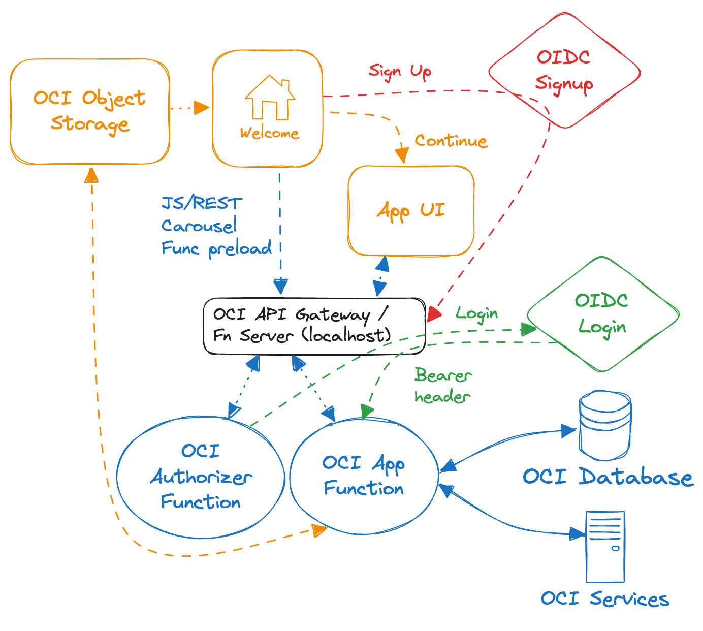

# Testimonials OCI Functions App

## Architecture 

## Authorizer function repo

https://github.com/mikarinneoracle/testimonials-authorizer-function

## UI and DB schema repo

https://github.com/mikarinneoracle/testimonials-ui-and-schema

## Terraform Stack for OCI DevOps

https://github.com/mikarinneoracle/testimonials-devops-tf-stack

## Local Fn config

<pre>
Fn contexts:
fn list context   

CURRENT NAME    PROVIDER        API URL                                                 REGISTRY
*       default default         http://localhost:8080                                   
        oci     oracle          https://functions.eu-frankfurt-1.oraclecloud.com        fra.ocir.io/frs...f35/

fn use context default
fn create app demo

Database (e.g. Autonoumus):

fn config app demo DB_USER admin

TLS:
fn config app demo DB_URL (description= (retry_count=20)(retry_delay=3)(address=(protocol=tcps)(port=1521)(host=adb.eu-frankfurt-1.oraclecloud.com))(connect_data=(service_name=g9......_fntest_tp.adb.oraclecloud.com))(security=(ssl_server_dn_match=yes)))
fn config app demo DB_PASSWORD WelcomeFolks123##
fn config app demo DB_WALLET_PASSWORD WelcomeFolks123##

mTLS with Vault:
fn config app demo DB_URL fntest_tp
fn config app demo DB_PASSWORD 'ocid1.vaultsecret.oc1.eu-frankfurt-1.amaaaa....izsxrjyyrxq'
fn config app demo DB_WALLET_PASSWORD 'ocid1.vaultsecret.oc1.eu-frankfurt-1.amaaaa....2gizsxrjyyrxq'
fn config app demo DB_WALLET_OCID 'ocid1.autonomousdatabase.oc1.eu-frankfurt-1.anthel....ihop3ziueesgq'

Triggers:
fn config app demo APP_URL http://localhost:8080/t/demo/invoke
fn config app demo WELCOME_URL http://localhost:8080/t/demo/invoke
fn config app demo AUTH_URL http://localhost:8080/t/demo/authenticate
fn config app demo SIGNUP_URL http://localhost:8080/t/demo/invoke?action=signup

IDCS:
fn config app demo CLIENT_ID 257b2496....ed90535a
fn config app demo CLIENT_SECRET idcscs-4f8....31c32932
fn config app demo IDCS_URL idcs-0a68e6....05a7b30
fn config app demo PROFILE_ID 08e1....9d65f44

GenAI:
fn config app demo COMPARTMENT_OCID 'ocid1.compartment.oc1..aaaaaa....nhmvgiqdatqgq'
fn config app demo GENAI_OCID 'ocid1.generativeaimodel.oc1.eu-frankfurt-1.amaaaa....gdcdhdu2whq'
fn config app demo GENAI_ENDPOINT https://inference.generativeai.eu-frankfurt-1.oci.oraclecloud.com

UI:
fn config app demo PAGE_URL https://objectstorage.eu-frankfurt-1.oraclecloud.com/n/frs...f35/b/pub/o/testimonial.html
fn config app demo SIGNUP_PAGE_URL https://objectstorage.eu-frankfurt-1.oraclecloud.com/n/frs...f35/b/pub/o/login.html
fn config app demo CAROUSEL_PAGE_URL https://objectstorage.eu-frankfurt-1.oraclecloud.com/n/frs...f35/b/pub/o/login_carousel.html

fn list config app demo

Deploy to localhost:
fn deploy --app demo  --local
</pre>

## OCI

For OCI use the following API Gateway URLs (instead of triggers) in Application config:

<pre>
APP_URL https://dc7ll...yzb4q.apigateway.eu-frankfurt-1.oci.customer-oci.com/testimonial
WELCOME_URL https://dc7ll...yzb4q.apigateway.eu-frankfurt-1.oci.customer-oci.com/welcome
AUTH_URL https://dc7ll...yzb4q.apigateway.eu-frankfurt-1.oci.customer-oci.com/login
SIGNUP_URL https://dc7ll...yzb4q.apigateway.eu-frankfurt-1.oci.customer-oci.com/welcome?action=signup

Deploy to OCI:
fn use context OCI
fn deploy --app demo-arm
</pre>